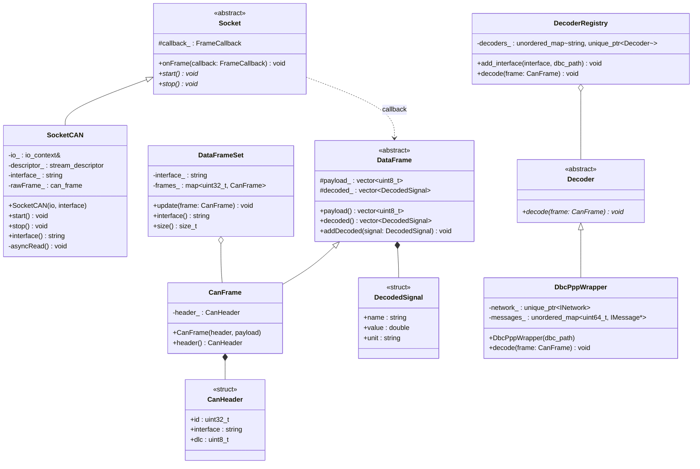

# Architecture

## Class Diagram

```mermaid
classDiagram
    direction TB

    class Socket {
        <<abstract>>
        #callback_ : FrameCallback
        +onFrame(callback: FrameCallback) void
        +start() void*
        +stop() void*
    }

    class SocketCAN {
        -io_ : io_context&
        -descriptor_ : stream_descriptor
        -interface_ : string
        -rawFrame_ : can_frame
        +SocketCAN(io, interface)
        +start() void
        +stop() void
        +interface() string
        -asyncRead() void
    }

    class DataFrame {
        <<abstract>>
        #payload_ : vector~uint8_t~
        #decoded_ : vector~DecodedSignal~
        +payload() vector~uint8_t~
        +decoded() vector~DecodedSignal~
        +addDecoded(signal: DecodedSignal) void
    }

    class CanFrame {
        -header_ : CanHeader
        +CanFrame(header, payload)
        +header() CanHeader
    }

    class CanHeader {
        <<struct>>
        +id : uint32_t
        +interface : string
        +dlc : uint8_t
    }

    class DecodedSignal {
        <<struct>>
        +name : string
        +value : double
        +unit : string
    }

    class DataFrameSet {
        -interface_ : string
        -frames_ : map~uint32_t, CanFrame~
        +update(frame: CanFrame) void
        +interface() string
        +size() size_t
    }

    class Decoder {
        <<abstract>>
        +decode(frame: CanFrame)* void
    }

    class DbcPppWrapper {
        -network_ : unique_ptr~INetwork~
        -messages_ : unordered_map~uint64_t, IMessage*~
        +DbcPppWrapper(dbc_path)
        +decode(frame: CanFrame) void
    }

    class DecoderRegistry {
        -decoders_ : unordered_map~string, unique_ptr~Decoder~~
        +add_interface(interface, dbc_path) void
        +decode(frame: CanFrame) void
    }

    Socket <|-- SocketCAN
    DataFrame <|-- CanFrame
    Decoder <|-- DbcPppWrapper
    DecoderRegistry o-- Decoder
    DataFrameSet o-- CanFrame
    CanFrame *-- CanHeader
    DataFrame *-- DecodedSignal
    Socket ..> DataFrame : callback
```
