# Architecture

## Class Diagram

```mermaid
classDiagram
    direction TB

    class Socket {
        <<abstract>>
        #callback_ : FrameCallback
        +onFrame(callback: FrameCallback) void
        +start() void*
        +stop() void*
    }

    class SocketCAN {
        -io_ : io_context&
        -descriptor_ : stream_descriptor
        -interface_ : string
        -rawFrame_ : can_frame
        +SocketCAN(io, interface)
        +start() void
        +stop() void
        +send(id, data) void
        +interface() string
        -asyncRead() void
    }

    class DataFrame {
        <<abstract>>
        #payload_ : vector~uint8_t~
        #decoded_ : vector~DecodedSignal~
        +payload() vector~uint8_t~
        +decoded() vector~DecodedSignal~
        +addDecoded(signal: DecodedSignal) void
    }

    class CanFrame {
        -header_ : CanHeader
        +CanFrame(header, payload)
        +header() CanHeader
    }

    class CanHeader {
        <<struct>>
        +id : uint32_t
        +interface : string
        +dlc : uint8_t
    }

    class DecodedSignal {
        <<struct>>
        +name : string
        +value : double
        +unit : string
    }

    class DataFrameSet {
        -interface_ : string
        -frames_ : map~uint32_t, CanFrame~
        +update(frame: CanFrame) void
        +interface() string
        +size() size_t
    }

    class Decoder {
        <<abstract>>
        +decode(frame: CanFrame)* void
    }

    class DbcPppWrapper {
        -network_ : unique_ptr~INetwork~
        -messages_ : unordered_map~uint64_t, IMessage*~
        +DbcPppWrapper(dbc_path)
        +decode(frame: CanFrame) void
    }

    class DecoderRegistry {
        -decoders_ : unordered_map~string, unique_ptr~Decoder~~
        +add_interface(interface, dbc_path) void
        +decode(frame: CanFrame) void
    }

    class InterfaceConfig {
        <<struct>>
        +name : string
        +dbc : string
        +baudrate : uint32_t
    }

    class Config {
        <<struct>>
        +virtual_can : bool
        +interfaces : vector~InterfaceConfig~
    }

    class SendSignal {
        <<struct>>
        +name : string
        +unit : string
        +min_val : double
        +max_val : double
        +value : double
        +sig : ISignal*
    }

    class SendMessage {
        <<struct>>
        +id : uint64_t
        +name : string
        +dlc : size_t
        +signals : vector~SendSignal~
    }

    class SendModel {
        -network_ : unique_ptr~INetwork~
        -messages_ : vector~SendMessage~
        +SendModel(dbc_path)
        +messages() vector~SendMessage~
        +set_value(msg_idx, sig_idx, value) void
        +encode(msg_idx) vector~uint8_t~
    }

    class Action {
        <<abstract>>
        #timer_ : steady_timer
        #interface_ : string
        #msg_id_ : uint64_t
        #msg_name_ : string
        #payload_ : vector~uint8_t~
        +is_periodic() bool*
        +type_name() string*
        +period() milliseconds*
        +start(on_fired, on_done) void
        +cancel() void
        #fire() void
        #schedule() void*
    }

    class SingleAction {
        +is_periodic() bool
        +type_name() string
        +period() milliseconds
        #schedule() void
    }

    class PeriodicAction {
        -period_ : milliseconds
        +is_periodic() bool
        +type_name() string
        +period() milliseconds
        #schedule() void
    }

    class ActionHandler {
        -io_ : io_context&
        -send_fn_ : SendFn
        -actions_ : vector~unique_ptr~Action~~
        -snapshot_ : vector~ActionInfo~
        -snapshot_mutex_ : mutex
        +add_action(action) void
        +remove_action(idx) void
        +snapshot() vector~ActionInfo~
        +set_notify(fn) void
        +io_ref() io_context&
        +send_fn_ref() SendFn&
    }

    class ActionInfo {
        <<struct>>
        +idx : size_t
        +msg_id : uint64_t
        +msg_name : string
        +interface : string
        +is_periodic : bool
        +period : milliseconds
        +last_sent : time_point
        +ever_sent : bool
    }

    class ProtoLog {
        -interface_ : string
        -pool_ : DescriptorPool
        -factory_ : DynamicMessageFactory
        -descriptors_ : unordered_map~uint64_t, Descriptor*~
        -field_names_ : unordered_map~uint64_t, map~string,string~~
        +ProtoLog(interface, dbc_path)
        +descriptor(msg_id) Descriptor*
        +serialize(frame) string
        +describe(frame) string
        -build_message(frame) unique_ptr~Message~
    }

    class ProtoLogRegistry {
        -logs_ : unordered_map~string, unique_ptr~ProtoLog~~
        +add_interface(interface, dbc_path) void
        +serialize(frame) string
        +describe(frame) string
        +get(interface) ProtoLog*
    }

    class Logger {
        <<abstract>>
        +log(frame, descriptor, serialized)* void
    }

    class McapLogger {
        -writer_ : McapWriter
        -channels_ : unordered_map~string, ChannelId~
        -schemas_ : unordered_map~string, SchemaId~
        +McapLogger(path)
        +log(frame, descriptor, serialized) void
        -get_or_register_schema(descriptor) SchemaId
        -get_or_register_channel(topic, schema_id) ChannelId
    }

    class GuiDataFrameSet {
        <<abstract>>
        +update(frame: CanFrame)* void
        +run()* void
    }

    class TuiDataFrameSet {
        -interfaces_ : vector~string~
        -send_models_ : map~string, SendModel~
        -action_handler_ : ActionHandler&
        -sets_ : map~string, DataFrameSet~
        -mutex_ : mutex
        -nav_level_ : int
        -main_tab_ : int
        -screen_ : ScreenInteractive
        +update(frame: CanFrame) void
        +run() void
        -render() Element
        -render_trace() Element
        -render_send() Element
        -render_actions() Element
    }

    Socket <|-- SocketCAN
    DataFrame <|-- CanFrame
    Decoder <|-- DbcPppWrapper
    DecoderRegistry o-- Decoder
    DataFrameSet o-- CanFrame
    CanFrame *-- CanHeader
    DataFrame *-- DecodedSignal
    Config *-- InterfaceConfig
    SendModel *-- SendMessage
    SendMessage *-- SendSignal
    Action <|-- SingleAction
    Action <|-- PeriodicAction
    ActionHandler o-- Action
    ActionHandler ..> ActionInfo : produces
    ProtoLogRegistry o-- ProtoLog
    Logger <|-- McapLogger
    GuiDataFrameSet <|-- TuiDataFrameSet
    TuiDataFrameSet o-- DataFrameSet
    TuiDataFrameSet o-- SendModel
    TuiDataFrameSet --> ActionHandler
    Socket ..> DataFrame : callback
```



## Configuration

`caneo.yaml` (or any file passed via `--config`) is parsed by `Config.cpp` using yaml-cpp.

```yaml
virtual: true          # optional — load vcan kernel module and create vcan interfaces
interfaces:
  vcan0:
    dbc: dbc/vcan0.dbc  # optional
    baudrate: 1000000   # used for real CAN interfaces (not vcan)
  vcan1:
    dbc: dbc/vcan1.dbc
    baudrate: 1000000
```

Old format (still supported):
```yaml
interfaces:
  vcan0: dbc/vcan0.dbc   # scalar value = dbc path only
```

## Interface setup

`setup_interfaces(Config)` runs at startup before any socket is opened:

- `virtual: true` → `modprobe vcan`, then per interface: create if missing + bring up
- `virtual: false` → per interface: set bitrate (if not already up) + bring up
- Existence check via `if_nametoindex()`, state check via `/sys/class/net/<name>/operstate`

## Startup flow

```
main()
 ├─ parse CLI args (--tui, --log, --debug, --config, interface:dbc …)
 ├─ load_config() / try_load_default_config()  →  Config
 ├─ setup_interfaces(config)
 ├─ [tui mode]
 │   ├─ build socket_map : map<string, SocketCAN*>
 │   ├─ SendFn  →  looks up socket by interface name, calls SocketCAN::send()
 │   ├─ ActionHandler(io, send_fn)
 │   ├─ TuiDataFrameSet(iface_configs, action_handler)
 │   ├─ ProtoLogRegistry  (built if --log)
 │   ├─ McapLogger(timestamped_file)  (created if --log)
 │   ├─ for each InterfaceConfig:
 │   │   ├─ DecoderRegistry::add_interface(name, dbc)
 │   │   ├─ SocketCAN::start()  →  async reads  →  onFrame callback
 │   │   │   ├─ DecoderRegistry::decode(CanFrame)
 │   │   │   ├─ TuiDataFrameSet::update(CanFrame)
 │   │   │   └─ [if --log] ProtoLogRegistry::serialize() → McapLogger::log()
 │   │   └─ socket_map[name] = socket.get()
 │   ├─ asio_thread: io_context::run()   (handles reads + action timers)
 │   ├─ TuiDataFrameSet::run()           (blocking, ftxui event loop)
 │   └─ logger.reset()                  (flush & close MCAP on quit)
 └─ [cli mode]
     ├─ ProtoLogRegistry  (always built)
     ├─ McapLogger(timestamped_file)  (created if --log)
     ├─ signal_set(SIGINT, SIGTERM)  →  logger.reset() + io.stop()
     ├─ for each InterfaceConfig:
     │   ├─ DecoderRegistry::add_interface(name, dbc)
     │   └─ SocketCAN::start()  →  onFrame callback
     │       ├─ [if --debug] DataFrameSet::update() + println
     │       ├─ [if --log]   ProtoLogRegistry::serialize() → McapLogger::log()
     │       └─ [else]       ProtoLogRegistry::describe() + println
     └─ io_context::run()  (blocking, until SIGINT/SIGTERM)
```

## CLI flags

| Flag | Effect |
|------|--------|
| `--tui` | Start interactive terminal UI |
| `--log` | Write decoded frames to a timestamped MCAP file (`caneo_YYYYMMDD_HHMMSS.mcap`) |
| `--debug` | Print frame data to stdout (CLI mode only, without `--tui`) |
| `--config <file>` | Load interface configuration from YAML file |

## Threading model

| Thread | Responsibilities |
|--------|-----------------|
| asio thread | Socket reads, `ActionHandler` mutations (via `post`), timer callbacks, `SocketCAN::send()` |
| ftxui thread (main) | TUI rendering, keyboard event handling, calling `add_action` / `remove_action` |

- `TuiDataFrameSet::sets_` — guarded by `mutex_`; written by asio thread, read by ftxui thread
- `ActionHandler::actions_` — only accessed on asio thread (no mutex needed)
- `ActionHandler::snapshot_` — guarded by `snapshot_mutex_`; written by asio thread, read by ftxui thread

## Protobuf / MCAP logging

One `ProtoLog` per interface. At construction it reads the DBC and dynamically builds
proto2 `FileDescriptorProto` descriptors — one proto message type per CAN message,
all signals as `optional double` fields.

`VECTOR__INDEPENDENT_SIG_MSG` is always excluded.

`McapLogger` writes Foxglove-compatible MCAP files:
- Schema: `FileDescriptorSet` serialized bytes, one schema per message type, keyed by fully-qualified type name
- Channel topic: `<interface>/<message_name>` (e.g. `vcan0/SS_ELMO_TARGET`)
- Schemas and channels are registered lazily on first message

## TUI navigation

Three main tabs, reachable via `t` / `s` / `a` from anywhere, or `←`/`→` on the main tab bar.

```
nav_level_ 0 — Main tab bar:   [Trace] [Send] [Actions]
nav_level_ 1 — Sub-tabs (Trace/Send) or Action list (Actions)
nav_level_ 2 — Message list (Send only)
nav_level_ 3 — Signal list + action buttons (Send only)
```

### Send / Signal view detail

- Signal rows: `→` enters value edit mode; type number, `←`/`Enter` confirm, `Esc` cancel
- Below signals: `[ Single Action ]` and `[ Periodic Action ]` buttons
  - `→` on Single Action → creates `SingleAction` immediately
  - `→` on Periodic Action → inline period input (ms); `←`/`→`/`Enter` confirm
